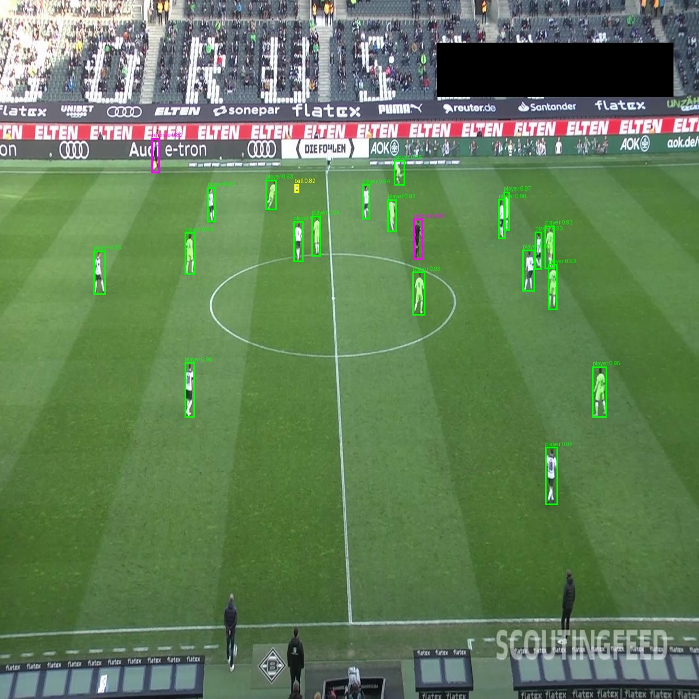
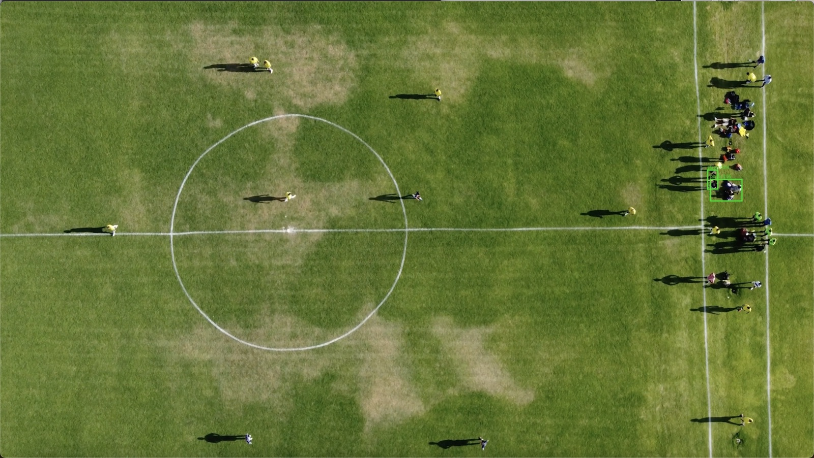
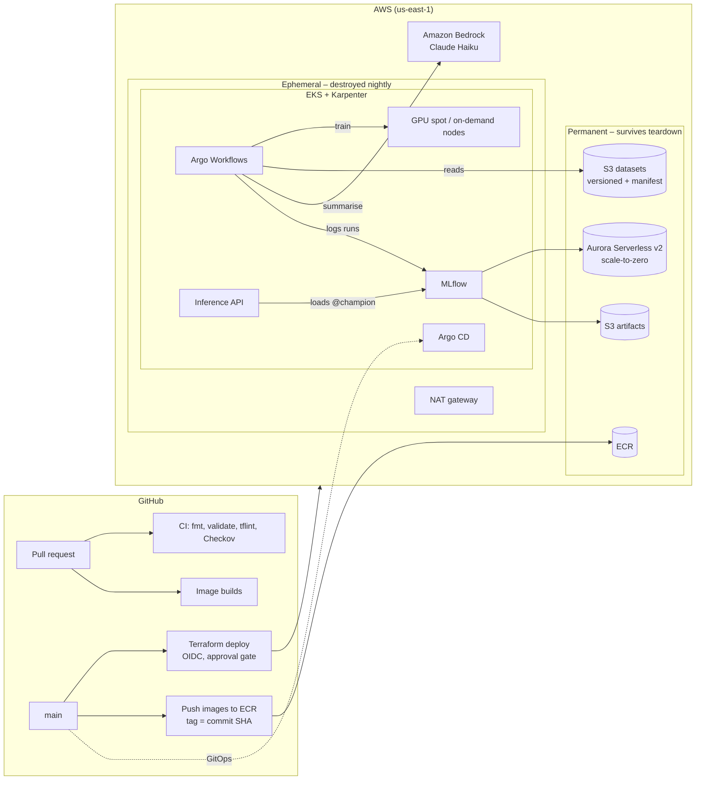

# PitchVision

**An end-to-end MLOps platform for football video analysis on AWS** – from versioned data and GPU training to a served model, video analysis and LLM-written match summaries. Everything is infrastructure as code, delivered through CI/CD and GitOps, traceable end to end, and switched off when not in use.

> Portfolio project built to demonstrate MLOps engineering: the platform *around* the model – reproducibility, automation, lineage, security and cost control.

<p align="center">
  
  
</p>
<p align="center"><em>Left: on broadcast footage like its training data, the model finds 19 players, both referees and the ball. Right: on a top-down drone shot it finds almost nothing – domain shift, made visible.</em></p>

---

## What it does

1. **Trains** an object detector (RT-DETRv2) to find **players, goalkeepers, referees and the ball**, on a GPU node that exists only while training runs.
2. **Tracks** every run in MLflow – parameters, metrics per class, the exact code, data and hardware – and **promotes** a new model to `@champion` only if it beats the current one on a held-out test set.
3. **Serves** the champion as a web API that returns detections or an annotated image.
4. **Analyses video** frame by frame, producing an annotated clip and statistics (player counts, when and where the ball was seen).
5. **Summarises** those statistics in plain English using **Claude on Amazon Bedrock**, grounded strictly in the numbers.

## Architecture



| Layer | What runs there |
| --- | --- |
| **Infrastructure** | Terraform stacks: account guardrails, network, NAT, data (Aurora + S3), registry, EKS, platform add-ons |
| **Delivery** | GitHub Actions with OIDC (no stored AWS keys): CI checks on every PR, plan posted to the PR, approval-gated apply; images built per commit |
| **Platform** | EKS with Karpenter (spot-first, GPU pool with on-demand fallback), Argo CD (app-of-apps), External Secrets, Pod Identity |
| **ML** | MLflow (Aurora + S3) for tracking and the model registry; Argo Workflows for training, video analysis and summaries |
| **Serving** | FastAPI inference service loading `models:/pitchvision-detector@champion` |
| **GenAI** | Claude Haiku 4.5 on Bedrock, IAM-scoped to a single model, every call traced in MLflow |

## Results

### Training: resolution matters for a tiny ball

RT-DETRv2-S fine-tuned on 298 broadcast frames (25 epochs, ~14–25 s per epoch on one T4). Test mAP on 25 held-out images:

| Class | v1 (640 px) | **v2 (960 px)** | Change |
| --- | --- | --- | --- |
| ball | 0.198 | **0.302** | +52% |
| goalkeeper | 0.683 | 0.753 | +0.070 |
| referee | 0.608 | 0.680 | +0.072 |
| player | 0.759 | 0.808 | +0.049 |
| **overall** | 0.562 | **0.636** | mAP@50 0.812 → 0.864 |

The ball is ~3.6% of labelled boxes and often a few pixels wide, so it was the weakest class – as predicted from the data before training. Raising the input resolution helped it most; validation agreed, so the gain is real rather than test-set noise. The registry promoted v2 to `@champion` automatically.

### Video: domain shift

The same champion model on three kinds of footage:

| | Broadcast frame (in domain) | Ground-level clip | Top-down drone clip |
| --- | --- | --- | --- |
| Detected per frame | 19 players, 2 referees, ball | 2.2 players (4 present) + 0.6 false "referees" | 2.4 players (~20 present) |
| Ball found | yes | 8% of frames | 4.5% of frames |

On unfamiliar footage the model misses players, mistakes training bibs for referee kits (a shortcut learned from its training data) and rarely finds a large, close ball (it learned "ball = tiny dot"). The fix is data from the target setting – and the pipeline makes retraining a parameter change and one command.

### Match summary (Claude Haiku on Bedrock)

The LLM never sees the video – only a digest of the detector's statistics, with the detector's real test scores as data-quality notes. Example, top-down clip:

> Over this 23-second clip, an average of 2.4 players were visible per frame, though player presence varied considerably. Early in the sequence (0–10 seconds), fewer players appeared on screen, averaging around 1–2 per frame. From 15 seconds onward, player visibility increased sharply to 4–4.5 per frame, suggesting the camera captured more of the pitch or players moved into frame. No goalkeepers were consistently detected. The ball was visible in only 4.5% of frames, appearing briefly around the 19–21 second mark on the right, far side of the pitch. A referee was barely present in the footage. The sparse ball detection and low overall visibility suggest this clip may feature wide-angle or non-standard camera angles that challenge the detector's accuracy, particularly for ball tracking.

610 input / 182 output tokens, 2.8 s. The prompt, its version and the token usage are logged with the run.

## Cost

| | |
| --- | --- |
| Platform running (cluster, NAT, nodes) | **~$0.40 per hour** |
| GPU training run (T4, ~8–12 min) | ~$0.10 |
| At rest (Aurora paused, S3, ECR) | pennies per day |

Permanent stacks hold only data; everything billed by the hour is destroyed nightly and rebuilt in ~20 minutes. About 21 cluster-hours in the first week of October cost ~$8.30 before tax. AWS Budgets and Cost Anomaly Detection alert by email.

## Engineering decisions

- **Permanent vs ephemeral stacks.** Data (S3, Aurora, ECR) is never touched by teardown; compute is. Proven by an MLflow run surviving a full destroy and rebuild.
- **No long-lived credentials.** GitHub → AWS via OIDC (trust pinned to immutable owner/repo IDs); pods → AWS via EKS Pod Identity; database password via External Secrets.
- **Least privilege.** The training role reads datasets but can't write them; the Bedrock permission covers exactly one model.
- **Lineage everywhere.** Images tagged by commit SHA (immutable); each run records image SHA, dataset version and GPU; datasets carry a manifest with source, licence and checksums.
- **Champion/challenger.** A new model takes the alias only if it beats the champion on test mAP; the service loads by alias, so promotion needs no code change.
- **Cost by design.** Spot-first Karpenter, GPU nodes that exist only during training, Aurora scale-to-zero, CPU-only serving image (399 MB vs 3.3 GB).

## Lessons learned

A few of the problems hit along the way, and the habit each one taught (the full playbook is in the build log):

| Problem | Lesson |
| --- | --- |
| Training pods never started; logs said `Deadline exceeded` | The real error was earlier: Argo couldn't read a private image's entrypoint (`401`). **Find the first error, not the last.** |
| `403 Invalid Host header` calling MLflow from a pod | MLflow 3 only trusts `localhost` by default – allow in-cluster hostnames explicitly |
| Renaming a Terraform key left CI with no cluster access | Renaming an address is replace, unless you add a `moved` block |
| MLflow `OOMKilled` even at 2 GiB | Memory scaled with worker processes – read the logs, don't just raise limits |
| A listed Bedrock model returned "end of life" | Listed isn't usable; keep model IDs as parameters |
| An LLM answered about *American* football | Ambiguous prompts produce confident wrong answers – be explicit |

## Repository layout

```
terraform/
  bootstrap/        # state bucket, GitHub OIDC roles (applied once by an admin)
  modules/          # cost-guardrails
  stacks/           # 00-account, 05-registry, 10-network, 15-nat, 18-data, 20-eks, 30-platform
gitops/
  bootstrap/        # Argo CD applications (app-of-apps)
  platform/         # Karpenter node pools, External Secrets, Argo Workflows templates
  apps/             # MLflow secrets, inference service
ml/
  training/         # RT-DETRv2 fine-tuning image
  inference/        # inference API, video analysis, Bedrock summaries
scripts/            # dataset fetch, workflow submission, smoke tests
.github/workflows/  # Terraform CI/deploy/destroy, image builds
```

## Running it

```bash
# Spin up: Actions → Terraform Deploy → Run workflow → all (approve), ~20 min
aws eks update-kubeconfig --name pitchvision-eks --region us-east-1

# Train (GPU), then analyse and summarise a clip (CPU + Bedrock)
kubectl create -f scripts/train/submit-training.yaml
kubectl create -f scripts/video/submit-analysis.yaml

# Results
kubectl port-forward -n mlflow svc/mlflow 5000:80            # MLflow UI
kubectl port-forward -n inference svc/inference 8080:80      # inference API
curl -F "file=@frame.jpg" localhost:8080/predict/annotated -o annotated.jpg

# Tear down: Actions → Terraform Destroy (also runs nightly)
```

## Roadmap

- Label frames from new camera angles and fine-tune, to address domain shift
- End-to-end pipeline: train → evaluate → register → roll out the new champion via GitOps
- Keep the best checkpoint by validation mAP; more epochs at 960 px
- Monitoring (Prometheus/Grafana), SSO, permissions boundary on the CI role

## Credits and licences

- **Training data:** [football-players-detection](https://universe.roboflow.com/roboflow-jvuqo/football-players-detection-3zvbc) by Roboflow, Roboflow Universe, licensed **CC BY 4.0** (version 13).
- **Model:** [RT-DETRv2](https://huggingface.co/PekingU/rtdetr_v2_r18vd) (`PekingU/rtdetr_v2_r18vd`), Apache-2.0.
- **Video clips:** Mixkit, under the Mixkit Stock Video Free License (raw clips are not redistributed in this repository).
